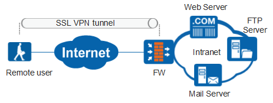
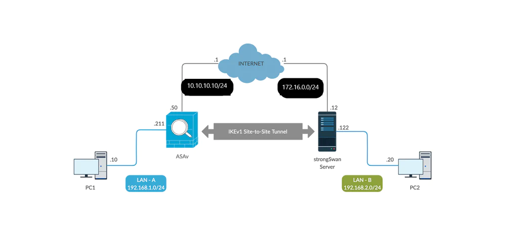
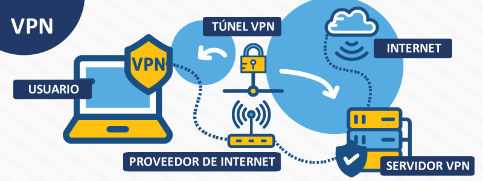
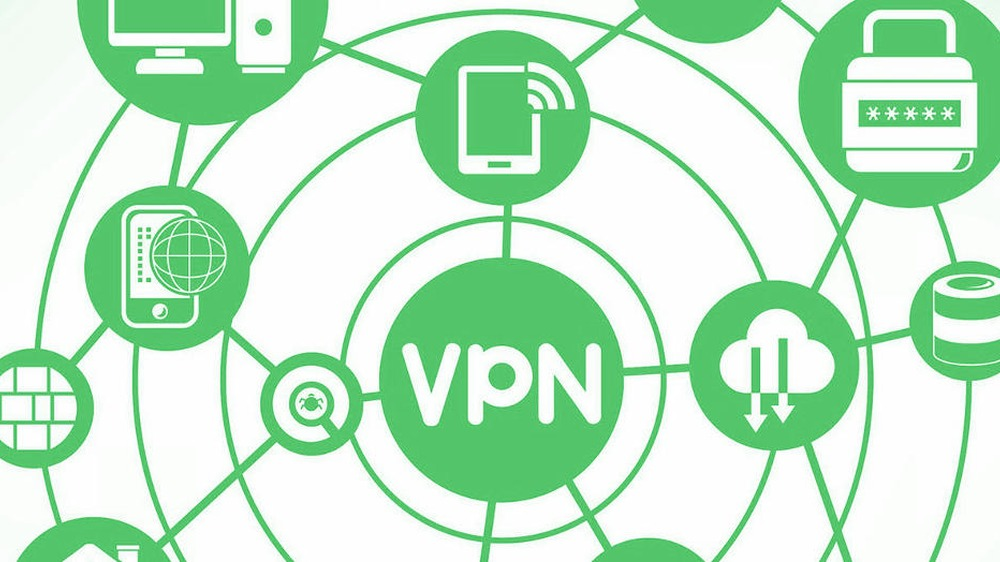
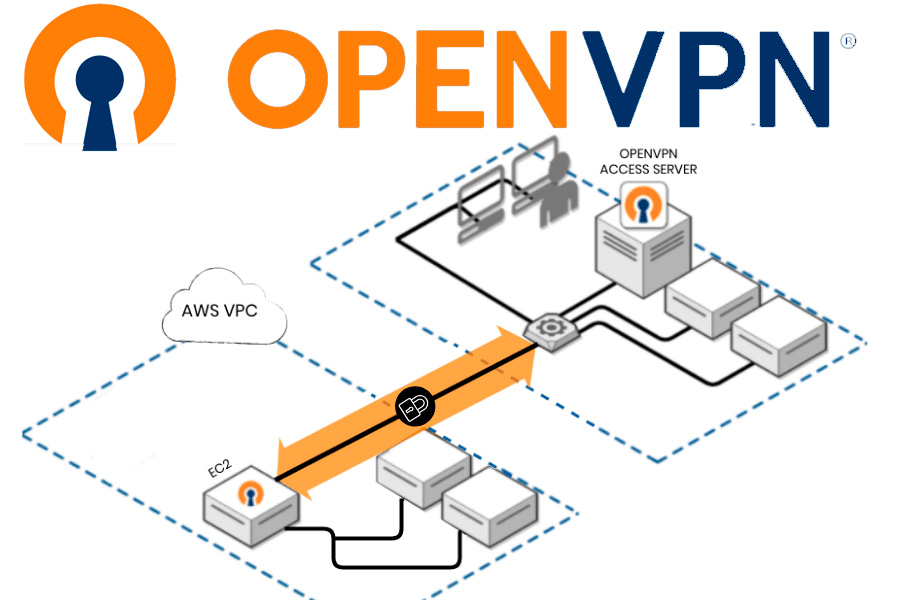
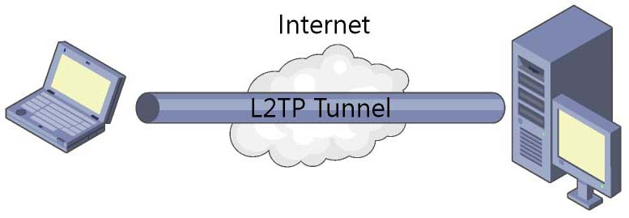
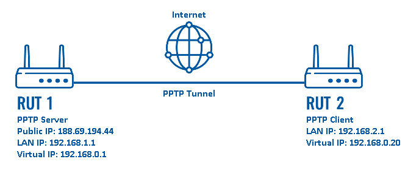
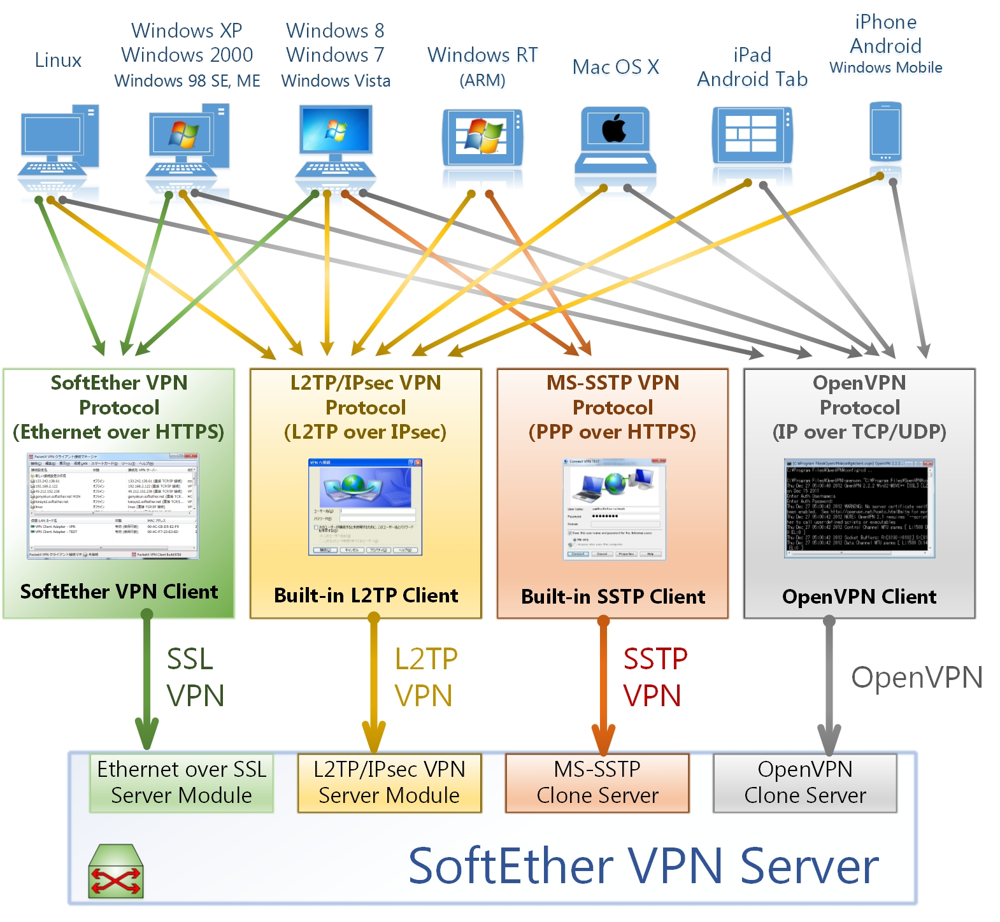
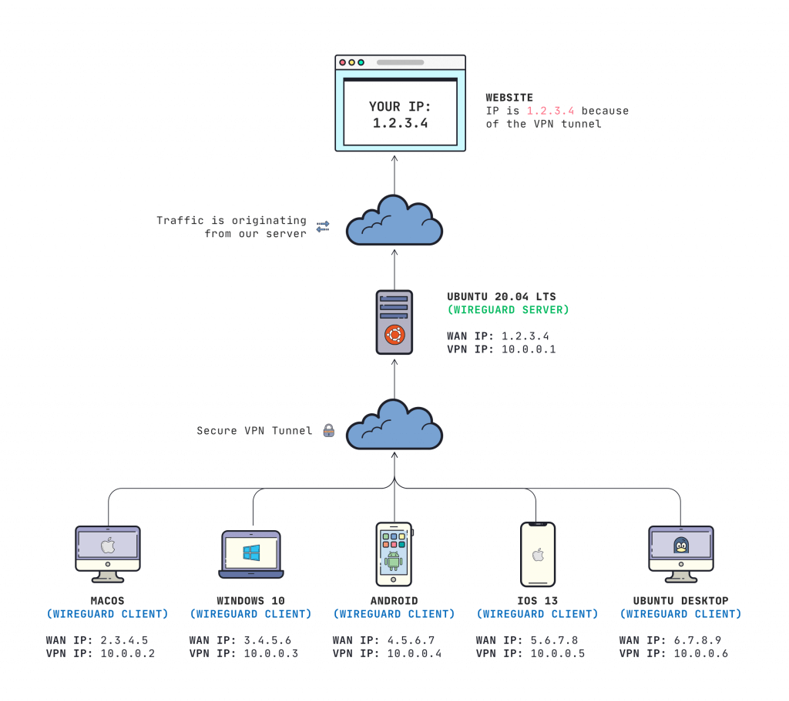

# **¿Que es un VPN?**

**VPN** significa **"Virtual Private Network"** (Red privada virtual) y describe la oportunidad de establecer una conexión protegida al utilizar redes públicas

Las VPN cifran su tráfico en internet y disfrazan su identidad en línea. Esto le dificulta a terceros el seguimiento de sus actividades en línea y el robo de datos. El cifrado se hace en tiempo real.

# **¿Cómo funciona una VPN?**

Una VPN oculta su verdadera dirección IP al permitirle a la red redireccionarla por un servidor remoto especial, alojado por el proveedor de una VPN. 

Esto significa que si navega en línea con una VPN, el servidor de la VPN se convierte en la fuente de sus datos. 

Esto significa que su Proveedor de servicios de internet (ISP) y otros terceros no pueden ver los sitios web que visita o qué datos envía y recibe en línea. 

Una VPN funciona como un filtro que convierte a todos sus datos en texto incomprensible. Si alguien lograra interceptar su información, de nada le sirve.

# **¿Cuáles son los beneficios de una conexión VPN?**

Una conexión VPN disfraza sus datos en línea y los protege del acceso externo. Cualquiera que tenga acceso a la red y quiera hacerlo puede ver los datos no cifrados. Con una VPN, los hackers y los cibercriminales no pueden descifrar estos datos.

* **Cifrado seguro:** Para leer los datos, necesita una clave de cifrado . Sin ella, le llevaría millones de años a una computadora descifrar el código en caso de un ataque de fuerza bruta. Con la ayuda de una VPN, sus actividades en línea se ocultan incluso en redes públicas.

* **Disfrazar su paradero:** Los servidores de VPN principalmente actúan como sus servidores proxy en internet. Debido a que los datos de ubicación demográficos provienen de un servidor en otro país, su ubicación real no se puede determinar. A esto se suma que, en la mayoría de los casos, los proveedores de estos servicios no guardan registros sobre sus actividades. Por otra parte, algunos proveedores registran su comportamiento, pero no transmiten esa información a terceros. Esto significa que cualquier registro potencial de su comportamiento de usuario permanece oculto de manera permanente.

* **Acceso a contenido regional:** El contenido web regional no siempre es accesible desde cualquier parte. Los servicios y los sitios web a menudo contienen contenido que solo puede accederse desde ciertas partes del mundo. Las conexiones estándar utilizan servidores locales en el país para determinar su ubicación. Esto significa que no puede acceder al contenido en casa mientras viaja, y no puede acceder a contenido internacional desde casa. Con la suplantación de ubiación de VPN, puede cambiar a un servidor a otro país y “cambiar” su ubicación de manera eficaz.

* **Transferencia segura de datos:** Si trabaja de forma remota, puede necesitar acceder a archivos importantes en la red de su empresa. Por razones de seguridad, este tipo de información requiere una conexión segura. Para obtener acceso a la red, a menudo se requiere una conexión VPN. Los servicios de VPN establecen conexiones con servidores privados y utilizan métodos de cifrado para reducir el riesgo de filtración de datos.

# **¿Por qué debería utilizar una conexión VPN?**

Su [ISP][2_3] normalmente configura su conexión cuando se conecta a internet. Lo rastrea mediante una dirección IP. El tráfico de su red se transmite a través de sus servidores de ISP, los cuales pueden registrar y mostrar todo lo que hace en línea.

Su ISP puede parecer confiable, pero puede compartir su historial de búsqueda con los anunciantes, la policía o el gobierno y/u otros terceros. Los ISP también pueden ser víctimas de ataques de los cibercriminales: si los hackean, sus datos personales y privados pueden verse comprometidos.

Esto es especialmente importante si acostumbra a usar redes Wi-Fi públicas. Nunca se sabe quién podría estar monitoreando su tráfico en internet y lo que podrían robarle, incluidas contraseñas, datos personales, información de pago o incluso su identidad.

# **¿Qué debe hacer una buena VPN?**

Debería confiar en su VPN para realizar una o más tareas. La VPN en sí misma también debe ser segura contra riesgos. Estas son las cualidades que deben esperarse de cualquier solución VPN completa:

Cifrado de su dirección IP: la función principal de una VPN es ocultar su dirección IP de su ISP y otros terceros. Esto le permite enviar y recibir información en línea con la tranquilidad de que nadie, excepto tú y el proveedor de la VPN, tendrá acceso a lo que hagas.

* **Cifrado de protocolos:** Una VPN le debe ayudar a no dejar rastros como cookies e historiales de búsquedas y navegación. El cifrado de cookies es especialmente importante porque le impide a terceros obtener acceso a información confidencial como datos personales, información financiera y otros contenidos en los sitios web.

* **Kill switch:** Si su conexión VPN se ve interrumpida repentinamente, su conexión segura también se verá interrumpida. Una buena VPN puede detectar este tiempo de inactividad repentino y finalizar los programas preseleccionados, lo que reduce la probabilildad de que se comprometan los datos.

* **Autenticación de dos factores:** Al utilizar una variedad de métodos de autenticación, una VPN fuerte verifica a cualquiera que intente iniciar sesión. Por ejemplo, se le podría pedir que ingrese una contraseña, luego de lo cual se envía un código a su dispositivo móvil. Esto le dificulta el acceso sin permiso a terceros a tu conexión segura.

# **¿Cómo mantenerse a salvo con una VPN?**

Una VPN cifra su comportamiento de navegación, el cual se puede decodificar con la ayuda de una clave. Solo su computadora y la VPN conocen esta clave, por lo que su ISP no puede reconocer dónde está navegando. Las distintas VPN utilizan diversos procesos de cifrado, pero generalmente funcionan en tres pasos:

1. Una vez que está en línea, inicie su VPN. La VPN funciona como un túnel entre usted y la internet. Su ISP y otros terceros no pueden detectar este túnel.

1. Su dispositivo ya está en la red local de la VPN y su dirección IP se puede cambiar a una dirección IP provista por el servidor VPN.

1. Ya puede navegar por internet a sus anchas, ya que la VPN protege todos sus datos personales.

# **¿Qué tipos de VPN existen?**

Existen muchas clases de VPN, pero vale la pena destacar tres:

<b>VPN configurada en SSL</b>

Con frecuencia no todos los empleados de una empresa tienen acceso a una computadora portátil que pueden usar para trabajar desde casa. Durante la crisis del coronavirus en la primavera del 2020, muchas empresas se enfrentaron al problema de no tener suficientes equipos para sus empleados. En esos casos, a menudo se recurre al uso de un dispositivo privado (PC, computadora portátil, tableta, teléfono móvil). En este caso, las empresas se respaldan en una solución SSL-VPN, la cual se implementa a través de una caja de hardware correspondiente.

El prerrequsito normalmente es un navegador HTML-5, el cual se utiliza para solicitar la página de inicio de sesión de una empresa. Los navegadores HTML-5 están disponibles para casi cualquier sistema operativo. El acceso está protegido con un usuario y contraseña.
_____________________________________________________________________________

<b>VPN de sitio a sitio</b>

Una **VPN de sitio a sitio** es, básicamente, una red privada que está diseñada para ocultar intranets privadas y dejar que los usuarios de estas redes seguras compartan recursos entre sí.

Una VPN de sitio a sitio es útil si tiene múltiples ubicaciones en su empresa, cada una con su propia red de área local (LAN) conectada a una WAN (red de área amplia). Las VPN de sitio a sitio también son útiles si tiene dos intranets separadas entre las cuales quiere enviar archivos sin usuarios de una intranet que accede explícitamente a otra.

Las VPN de sitio a sitio se usan, sobre todo, en las grandes empresas. Son complejas de implementar y no ofrecen la misma flexibilidad que las VPN SSL. Sin embargo, son las más eficaces para asegurar la comunicación dentro de y entre grandes departamentos.

<b>VPN cliente a proveedor</b>

Conectarse a través de un **cliente VPN** se puede pensar como si estuviera conectando su PC personal a la empresa con un cable de extensión. Los empleados pueden marcar hacia una red de la empresa desde su trabajo en casa a través de la conexión segura y actuar como si estuvieran sentados en la oficina. Sin embargo, un cliente VPN primero debe estar instalado y configurado en la computadora.

Esto implica que el usuario no esté conectado a internet desde su propio ISP, sino que establece una conexión directa a través de su proveedor de VPN. Básicamente, permite eliminar la fase de túnel del recorrido de la VPN. No es necesario usar la VPN para crear un túnel cifrado que permita ocultar la conexión a internet existente: la VPN se encarga de cifrar el tráfico automáticamente antes de que llegue al usuario.

Este tipo de VPN es cada vez más común; resulta particularmente útil para los proveedores que brindan acceso a través de redes WLAN inseguras. Impide que terceros accedan a la conexión de red y comprometan la conexión de la red y cifra los datos hasta el proveedor. También impide que las ISP accedan a datos que, por alguna razón, permanecen sin cifrado y evitan cualquier restricción al acceso a internet de un usuario **(por ejemplo, si el gobierno de ese país restringe el acceso a internet)**.

La ventaja de este tipo de acceso a la VPN es una mayor eficacia y acceso universal a los recursos de una empresa. Siempre que esté disponible un sistema telefónico apropiado, el empleado puede, por ejemplo, conectarse al sistema con un audífono y actuar como si estuviera en el lugar de trabajo de la empresa. Por ejemplo, los clientes de una empresa no se pueden dar cuenta de si el empleado está en el trabajo en la empresa o en su oficina en casa.

# **¿Cuántos protocolos VPN hay?**

Las conexiones VPN usan una conexión cifrada también llamada túnel. Hay varias formas distintas (protocolos) de configurar dicha conexión VPN. Estos protocolos se aseguran de que tus datos estén a salvo y que otros no puedan leerlos. 

Los [protocolos VPN][2_5] más comunes son:

* **OpenVPN:** OpenVPN es uno de los protocolos VPN más usados. Es un protocolo de código abierto que utiliza cifrado basado en los protocolos OpenSSL y SSLv3/TLSv1. La mayoría de servicios de VPN admiten OpenVPN y está disponible para muchas plataformas distintas (por ejemplo, Windows, Mac (OSx), Android, iOS, Linux, routers). La mayoría considera que OpenVPN es la mejor opción. La única desventaja es que no funciona en Mac OS e iOS, por lo que debes usar un protocolo distinto para ello (como, IKEv2/IPsec).

* **IPsec/L2TP:** Este protocolo combina **IPsec** para el cifrado de datos con **L2TP** para realizar la conexión segura. La mayoría de los sistemas operativos incluyen IPsec/L2TP y es una buena opción si OpenVPN no está disponible.
IKEv2/IPsec: IKEv2 es un protocolo basado en IPSec. Este protocolo puede rápidamente conectar e intercambiar entre servidores. Esto lo convierte en una opción ideal para smartphones, ya que estos dispositivos tienden a cambiar regularmente entre redes Wi-Fi y redes Wi-Fi públicas. Según las mismas fuentes, IKEv2 es más rápido que OpenVPN. Aun así, a OpenVPN se le considera el mejor protocolo.

* **PPTP:** PPTP (Protocolo de túnel punto a punto) es uno de los primeros protocolos que estuvieron disponibles. Este protocolo contiene algunas (potenciales) fugas. Por esta razón, el uso de este protocolo solo es aconsejable si la velocidad es más importante que la seguridad. Este podría ser el caso si quieres evitar las restricciones establecidas por los servicios de streaming.

* **Softether:** Softether, a diferencia de los otros protocolos VPN mencionados, no es un protocolo independiente, sino una aplicación de código abierto que funciona en diferentes plataformas y ofrece soporte para protocolos VPN como SSL VPN, L2TP/IPsec, OpenVPN y Microsoft Secure Socket Tunneling Protocol.

* **WireGuard:** WireGuard es un protocolo relativamente nuevo que ha ido ganando popularidad. Se ejecuta en un kernel de Linux y tiene como objetivo lograr un rendimiento aún mejor que OpenVPN e IPsec. Aún está en desarrollo, por lo que mejor que uses OpenVPN de momento.

# **Mas información**
* [¿Qué es una conexión VPN, para qué sirve y qué ventajas tiene?][2_1]
* [¿Qué es una VPN y cómo funciona?][2_2]
* [ISP: ¿Qué es y para qué sirve?][2_4]

[2_1]:https://www.xataka.com/basics/que-es-una-conexion-vpn-para-que-sirve-y-que-ventajas-tiene

[2_2]:https://latam.kaspersky.com/resource-center/definitions/what-is-a-vpn

[2_3]:https://sumamovil.com.co/glosario/isp-que-es-y-para-que-sirve

[2_4]:https://sumamovil.com.co/glosario/isp-que-es-y-para-que-sirve

[2_5]:https://vpnoverview.com/es/informacion-vpn/protocolos-vpn/