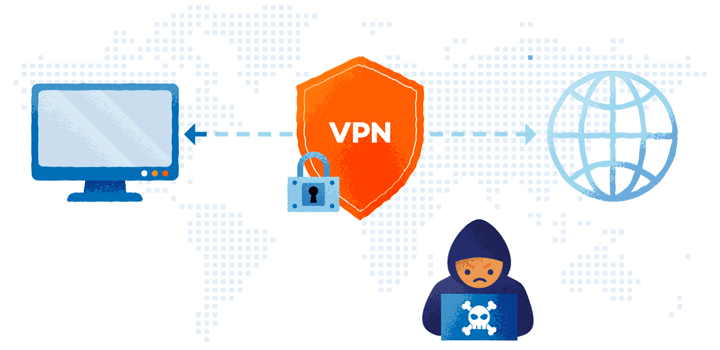

# **¿Que es un VPN?**

**VPN** significa **"Virtual Private Network"** (Red privada virtual) y describe la oportunidad de establecer una conexión protegida al utilizar redes públicas. 

Las VPN cifran su tráfico en internet y disfrazan su identidad en línea. Esto le dificulta a terceros el seguimiento de sus actividades en línea y el robo de datos. El cifrado se hace en tiempo real.

# **¿Cómo funciona una VPN?**

Una VPN oculta su verdadera dirección IP al permitirle a la red redireccionarla por un servidor remoto especial, alojado por el proveedor de una VPN. 

Esto significa que si navega en línea con una VPN, el servidor de la VPN se convierte en la fuente de sus datos. 

Esto significa que su Proveedor de servicios de internet (ISP) y otros terceros no pueden ver los sitios web que visita o qué datos envía y recibe en línea. 

Una VPN funciona como un filtro que convierte a todos sus datos en texto incomprensible. Si alguien lograra interceptar su información, de nada le sirve.

# **¿Cuáles son los beneficios de una conexión VPN?**

Una conexión VPN disfraza sus datos en línea y los protege del acceso externo. Cualquiera que tenga acceso a la red y quiera hacerlo puede ver los datos no cifrados. Con una VPN, los hackers y los cibercriminales no pueden descifrar estos datos.

* **Cifrado seguro:** Para leer los datos, necesita una clave de cifrado . Sin ella, le llevaría millones de años a una computadora descifrar el código en caso de un ataque de fuerza bruta. Con la ayuda de una VPN, sus actividades en línea se ocultan incluso en redes públicas.

* **Disfrazar su paradero:** Los servidores de VPN principalmente actúan como sus servidores proxy en internet. Debido a que los datos de ubicación demográficos provienen de un servidor en otro país, su ubicación real no se puede determinar. A esto se suma que, en la mayoría de los casos, los proveedores de estos servicios no guardan registros sobre sus actividades. Por otra parte, algunos proveedores registran su comportamiento, pero no transmiten esa información a terceros. Esto significa que cualquier registro potencial de su comportamiento de usuario permanece oculto de manera permanente.

* **Acceso a contenido regional:** El contenido web regional no siempre es accesible desde cualquier parte. Los servicios y los sitios web a menudo contienen contenido que solo puede accederse desde ciertas partes del mundo. Las conexiones estándar utilizan servidores locales en el país para determinar su ubicación. Esto significa que no puede acceder al contenido en casa mientras viaja, y no puede acceder a contenido internacional desde casa. Con la suplantación de ubiación de VPN, puede cambiar a un servidor a otro país y “cambiar” su ubicación de manera eficaz.

* **Transferencia segura de datos:** Si trabaja de forma remota, puede necesitar acceder a archivos importantes en la red de su empresa. Por razones de seguridad, este tipo de información requiere una conexión segura. Para obtener acceso a la red, a menudo se requiere una conexión VPN. Los servicios de VPN establecen conexiones con servidores privados y utilizan métodos de cifrado para reducir el riesgo de filtración de datos.

# **¿Por qué debería utilizar una conexión VPN?**

Su [ISP][2_3] normalmente configura su conexión cuando se conecta a internet. Lo rastrea mediante una dirección IP. El tráfico de su red se transmite a través de sus servidores de ISP, los cuales pueden registrar y mostrar todo lo que hace en línea.

Su ISP puede parecer confiable, pero puede compartir su historial de búsqueda con los anunciantes, la policía o el gobierno y/u otros terceros. Los ISP también pueden ser víctimas de ataques de los cibercriminales: si los hackean, sus datos personales y privados pueden verse comprometidos.

Esto es especialmente importante si acostumbra a usar redes Wi-Fi públicas. Nunca se sabe quién podría estar monitoreando su tráfico en internet y lo que podrían robarle, incluidas contraseñas, datos personales, información de pago o incluso su identidad.

# **¿Qué debe hacer una buena VPN?**

Debería confiar en su VPN para realizar una o más tareas. La VPN en sí misma también debe ser segura contra riesgos. Estas son las cualidades que deben esperarse de cualquier solución VPN completa:

Cifrado de su dirección IP: la función principal de una VPN es ocultar su dirección IP de su ISP y otros terceros. Esto le permite enviar y recibir información en línea con la tranquilidad de que nadie, excepto tú y el proveedor de la VPN, tendrá acceso a lo que hagas.

* **Cifrado de protocolos:** Una VPN le debe ayudar a no dejar rastros como cookies e historiales de búsquedas y navegación. El cifrado de cookies es especialmente importante porque le impide a terceros obtener acceso a información confidencial como datos personales, información financiera y otros contenidos en los sitios web.

* **Kill switch:** Si su conexión VPN se ve interrumpida repentinamente, su conexión segura también se verá interrumpida. Una buena VPN puede detectar este tiempo de inactividad repentino y finalizar los programas preseleccionados, lo que reduce la probabilildad de que se comprometan los datos.

* **Autenticación de dos factores:** Al utilizar una variedad de métodos de autenticación, una VPN fuerte verifica a cualquiera que intente iniciar sesión. Por ejemplo, se le podría pedir que ingrese una contraseña, luego de lo cual se envía un código a su dispositivo móvil. Esto le dificulta el acceso sin permiso a terceros a tu conexión segura.

# **Mas información**
* [¿Qué es una conexión VPN, para qué sirve y qué ventajas tiene?][2_1]
* [¿Qué es una VPN y cómo funciona?][2_2]
* [ISP: ¿Qué es y para qué sirve?][2_4]

[2_1]:https://www.xataka.com/basics/que-es-una-conexion-vpn-para-que-sirve-y-que-ventajas-tiene

[2_2]:https://latam.kaspersky.com/resource-center/definitions/what-is-a-vpn

[2_3]:https://sumamovil.com.co/glosario/isp-que-es-y-para-que-sirve

[2_4]:https://sumamovil.com.co/glosario/isp-que-es-y-para-que-sirve