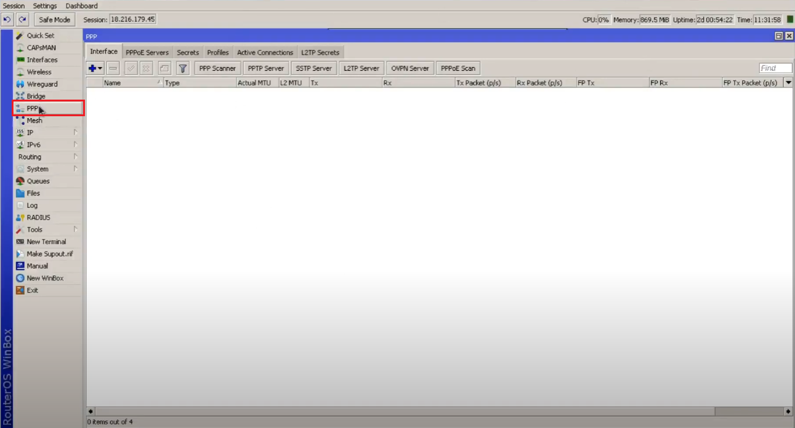
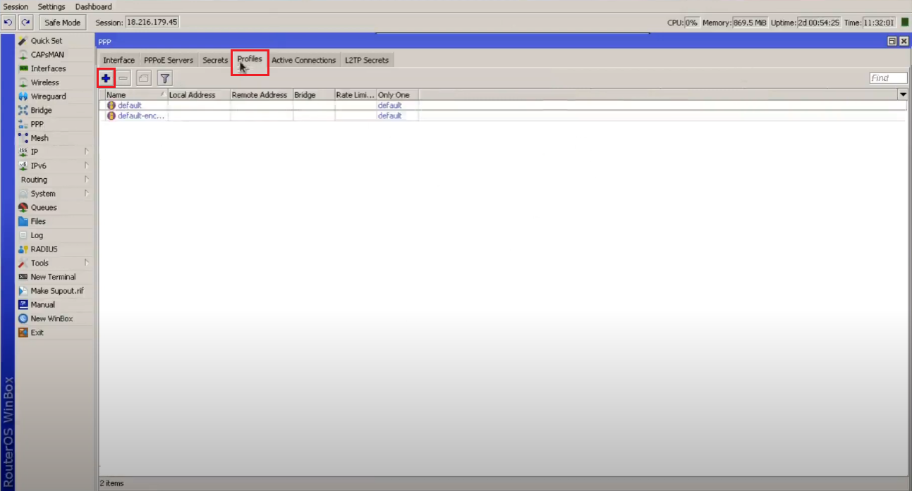
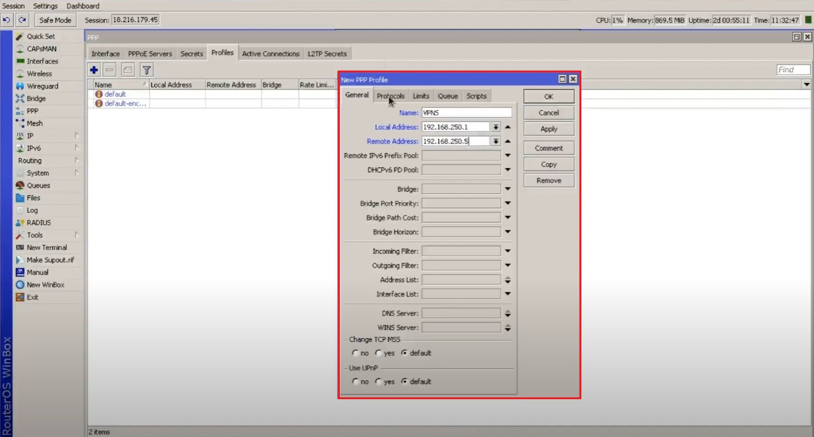
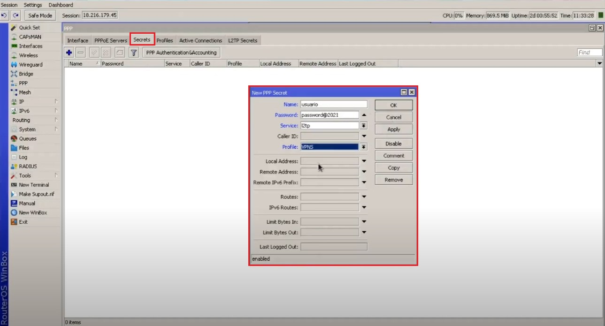
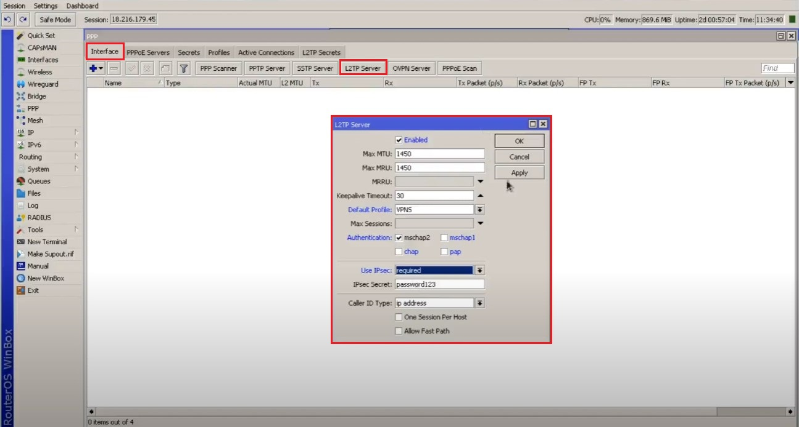
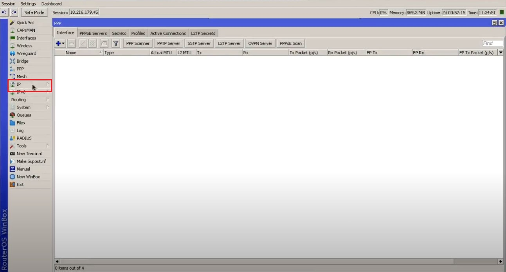
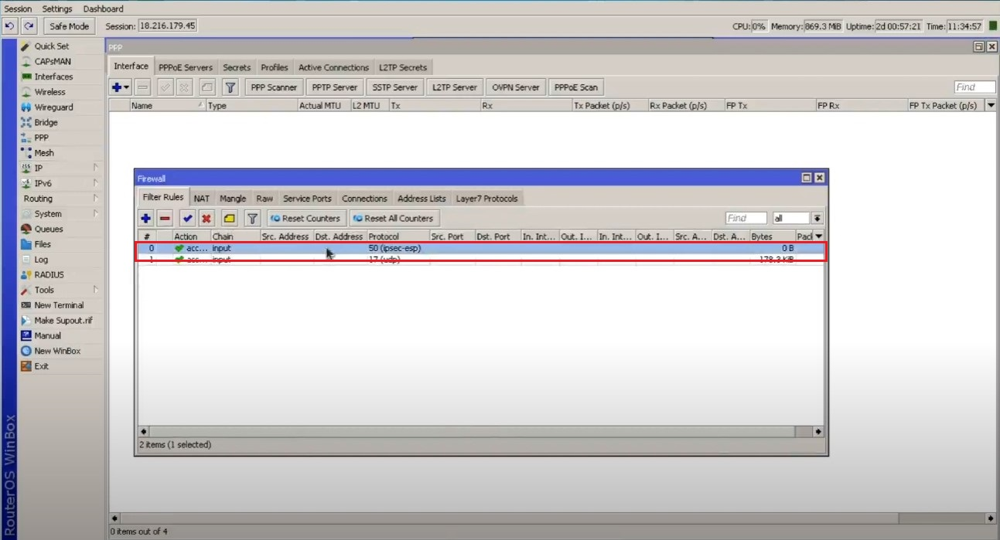
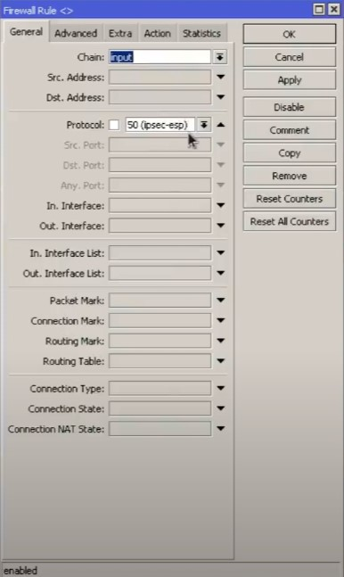
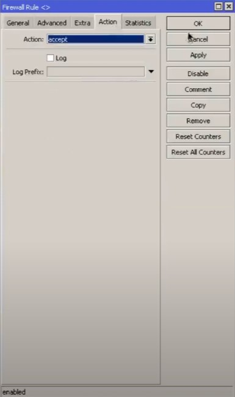
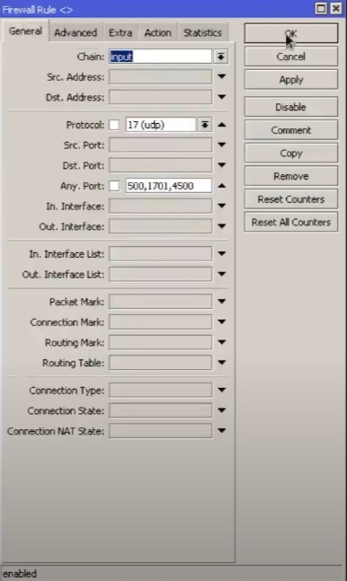

<H1>
CONFIGURACION DE VPN CON MIKROTIK</H1>

<text style = "display:block; text-align: justify"> Con la Ayuda del software **RouterOS Winbox** la cual es una aplicación que nos permite la administracion de **Mikrotik** usando una interfaz gráfica. El cual incluye una sofisticada tecnología para realizar estas conexiones basada en el sistema operativo RouterOS. Este software permite a sus usuarios realizar conexiones vía FTP, telnet y SSH.

<text style = "display:block; text-align: justify"> Utilizaremos el protrocolo IPSEC/L2TP para lograr la conexion con el VPN que vamos a configurar, ya que este protocolo estandar que ya viene
en la mayoria de dispositivos de computo y moviles actualmente y de esta forma no utilizar clientes de terceros.

Primero vamos a ir al botón de **PPP**  

Luego a **Profiles** y al botón **+**

<text style = "display:block; text-align: justify">En este apartado, crearemos un perfil de la siguiente forma:

<text style = "display:block; text-align: justify"> Luego vamos al apartado de **Protocols** y lo configuramos de la siguiente form (despues solo le damos en el Boton de **OK** ):

<text style = "display:block; text-align: justify"> Despues de terminar con la configuracion del perfil vamos a crear un usuario dandole al botón de Secrets, donde pondremos un Nombre de usuario,
contraseña, servicio y seleccionamos el Perfil que hicimos anteriormente, Ejemplo:

<text style = "display:block; text-align: justify"> Continuamos nuestra configuración en el botón de **Interface** luego le damos en el botón de **L2TP Server** y configuramos el apartado de la siguiente forma:

<text style = "display:block; text-align: justify"> Luego solo le damos en **Apply** y **OK**

De esta forma ya tendriamos configurada nuestra VPN, pero necesitamos abrir unos puertos en la parte de **Firewall** para que la VPN funcione correctamente.
Para esto nos vamos al botón de **IP**

<text style = "display:block; text-align: justify"> Luego damos click en el **+** y añadiremos una por una estas 2 reglas que veremos en el siguiente listado:

<text style = "display:block; text-align: justify"> En la primera lo configuraremos de la siguiente forma: 

En **General** 

En **Action** 

Y en al segunda Regla: 

En **General** 

  

En **Action** 

<H1>
 Y listo eso seria todo 😁😁 </H1>

