# **Guía / Tutorial para crear tu propia VPN con Windows 10**

Hoy en día existen un gran número de proveedores comerciales que son capaces de ofrecer el servicio para crear una VPN que te proporcione todo el acceso y garantías de seguridad. Sin embargo, si se busca algo sencillo que permita trabajar fácilmente también es posible hacer uso de un equipo con **Windows 10** con el que montar una **VPN propia.**

Para ello debemos seguir unos pasos que se detallan a continuación:

1. Vamos a **Panel de Control** -> **Redes e Internet** -> **Centro de redes y recursos compartidos**

1. Accedemos a **Cambiar configuración del adaptador**

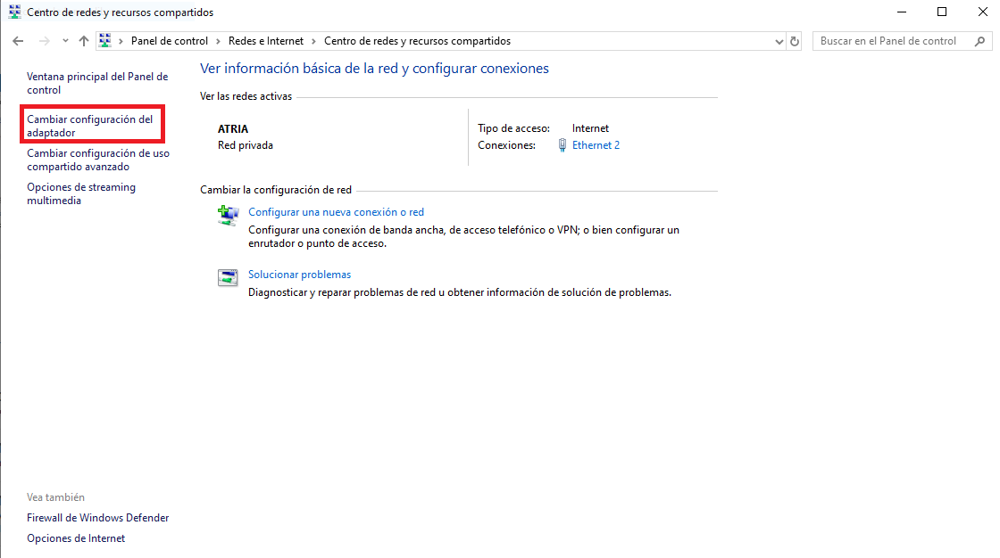

3. Presionamos la tecla **“Alt”** y seleccionamos **“Archivo”** -> **Nueva conexión entrante**

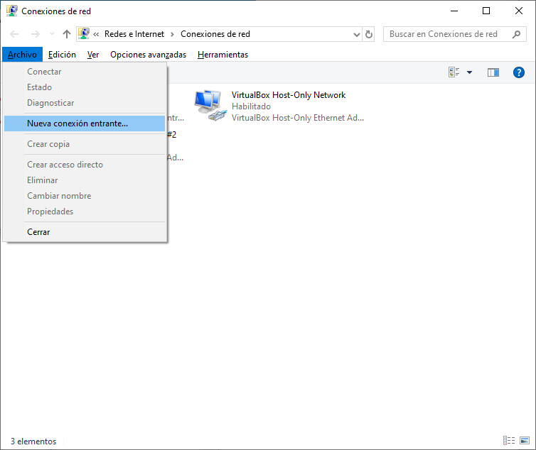

4. Damos acceso a los usuarios que queramos que accedan a la VPN o creamos nuevos usuarios, estos usuarios serán los que utilizaremos posteriormente para conectarnos a la VPN.

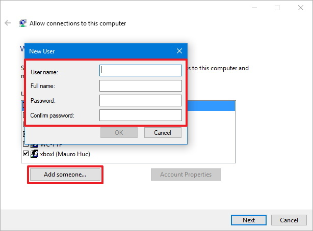

5. Nos aseguramos de que la casilla **“a través de internet”** está marcada y le damos en siguiente.

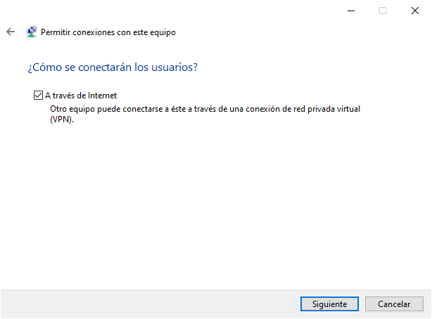

6. Seleccionamos **IPV4** y abrimos sus propiedades.

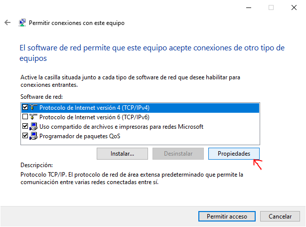

7. Marcamos la casilla de **acceso a la red** y **especificamos las direcciones IP** de los clientes que tendrán acceso usando VPN (se recomienda usar el rango superior de direcciones IP para evitar problemas con las que distribuye el router).

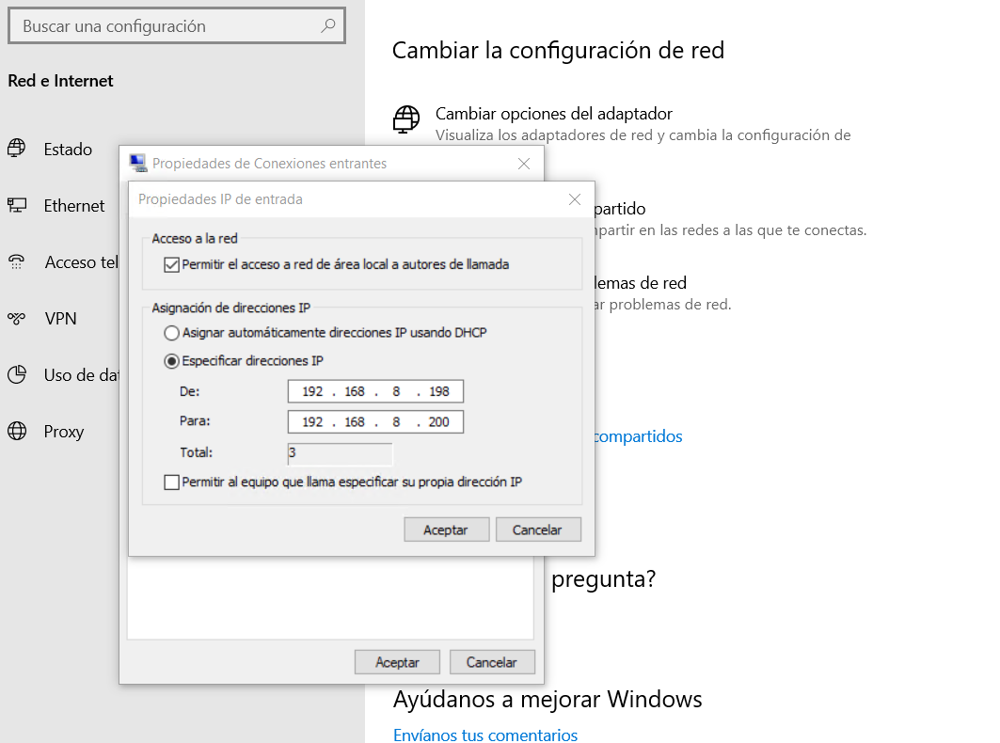

8. Seleccionamos **permitir acceso** y cerramos.

Con estos pasos habremos configurado un servidor VPN en Windows 10, sin embargo, para que su funcionamiento sea correcto debemos hacer unos cuantos pasos más.

**Configuración del Firewall**. Para que la conexión al servidor VPN sea posible debemos permitir que el firewall de nuestro servidor permita el acceso, para ello realizaremos los siguientes pasos:

1. Accedemos a **Firewall y protección de red** -> **Permitir una aplicación a través de firewall**

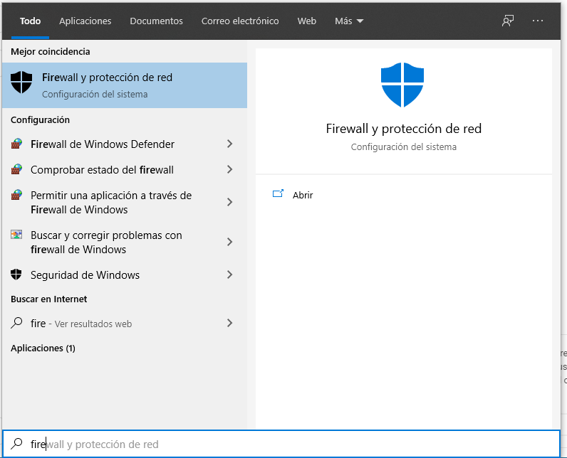

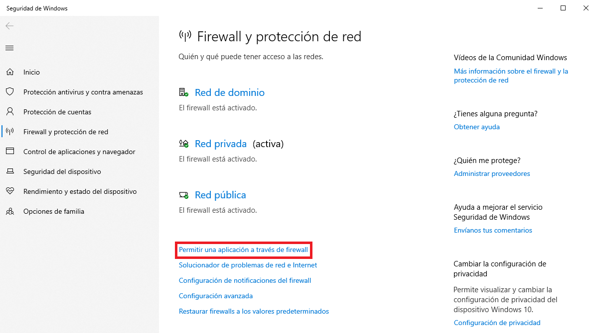

2. Pulsamos en **Cambiar la configuración.**

3. Buscamos **Enrutamiento y acceso remoto** -> Marcamos tanto la opción de privado como de público -> **Pulsamos Aceptar**.

4. Abrimos **PowerShell** como administrador (clic derecho powershell y ejecutar como administrador)

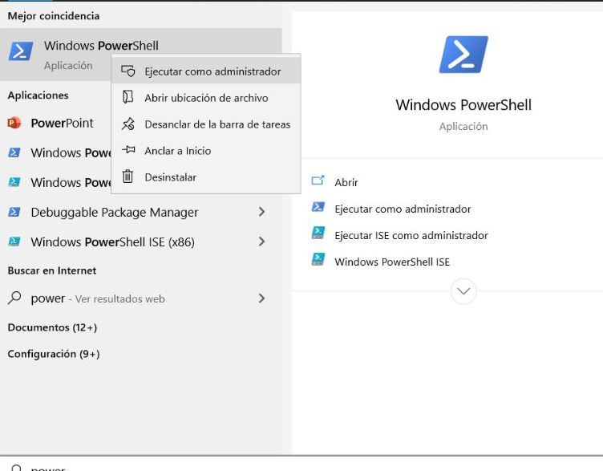

5. **Escribimos Get-NetConnectionProfile** para ver las redes disponibles.

6. Con el comando “**Set-NetConnectionProfile -interfaceIndex** [Nombre de la red que queremos cambiar **–NetworkCategory Private**]“ De esta forma ponemos la red en privado para que el firewall no de problemas.

7. Por último, debemos acceder a nuestro router y abrir el puerto **1723**, que es el destinado a este tipo de conexiones, de esta manera cuando intentemos conectarnos no seremos rechazados.

Con estos pasos habremos configurado la seguridad de nuestro sistema para permitir la conexión a nuestro servidor **VPN**.

# **Configurar Inicio Automático**

Para que el servidor VPN se inicie cada vez que se encienda el sistema debemos seguir los siguientes pasos:

1. Accedemos a la aplicación Servicios de Windows.

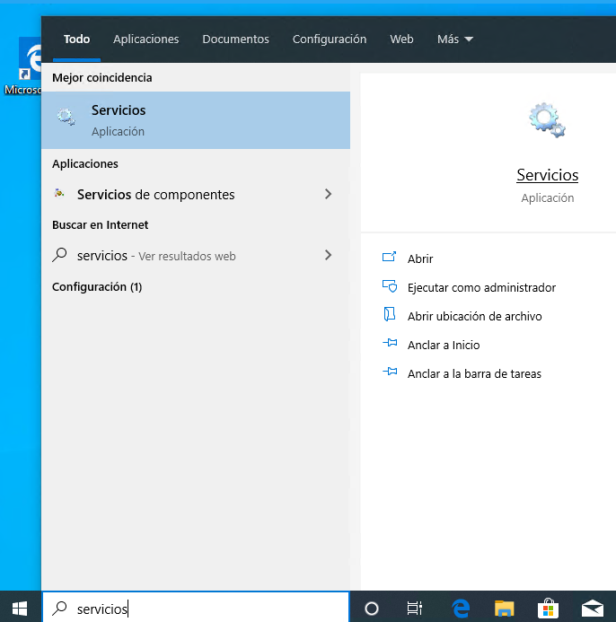

2. Una vez iniciada buscamos el servicio “**Enrutamiento y Acceso remoto**” y accedemos a sus propiedades.

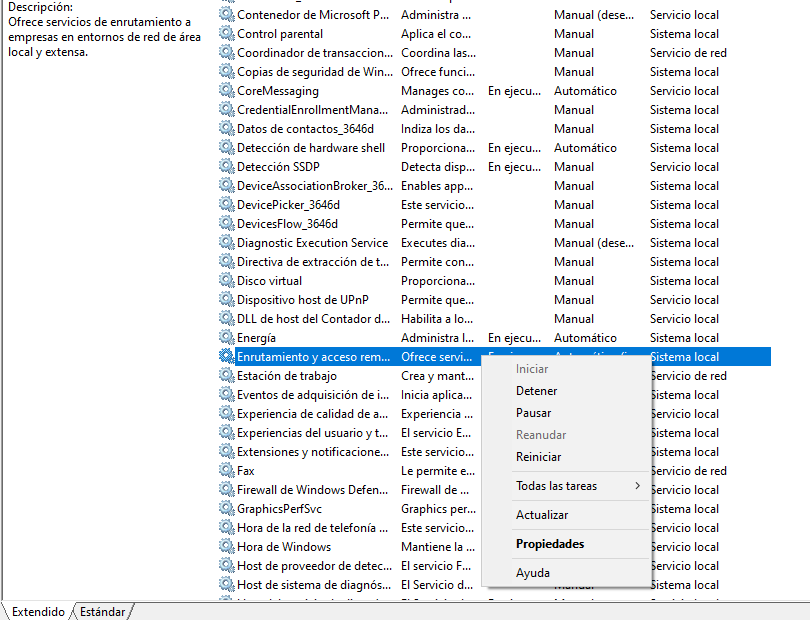
