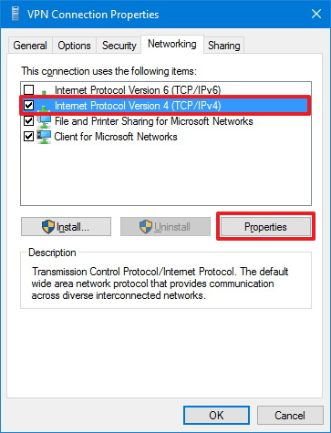

# **Guía / Tutorial para crear tu propia VPN con Windows 10**

Hoy en día existen un gran número de proveedores comerciales que son capaces de ofrecer el servicio para crear una VPN que te proporcione todo el acceso y garantías de seguridad. Sin embargo, si se busca algo sencillo que permita trabajar fácilmente también es posible hacer uso de un equipo con **Windows 10** con el que montar una **VPN propia.**

Para ello debemos seguir unos pasos que se detallan a continuación:

1. Vamos a **Panel de Control** -> **Redes e Internet** -> **Centro de redes y recursos compartidos**

1. Accedemos a **Cambiar configuración del adaptador**

3. Presionamos la tecla **“Alt”** y seleccionamos **“Archivo”** -> **Nueva conexión entrante**

4. Damos acceso a los usuarios que queramos que accedan a la VPN o creamos nuevos usuarios, estos usuarios serán los que utilizaremos posteriormente para conectarnos a la VPN.

5. Nos aseguramos de que la casilla **“a través de internet”** está marcada y le damos en siguiente.

6. Seleccionamos **IPV4** y abrimos sus propiedades.

7. Marcamos la casilla de **acceso a la red** y **especificamos las direcciones IP** de los clientes que tendrán acceso usando VPN (se recomienda usar el rango superior de direcciones IP para evitar problemas con las que distribuye el router).

8. Seleccionamos **permitir acceso** y cerramos.

Con estos pasos habremos configurado un servidor VPN en Windows 10, sin embargo, para que su funcionamiento sea correcto debemos hacer unos cuantos pasos más.

**Configuración del Firewall**. Para que la conexión al servidor VPN sea posible debemos permitir que el firewall de nuestro servidor permita el acceso, para ello realizaremos los siguientes pasos:

1. Accedemos a **Firewall y protección de red** -> **Permitir una aplicación a través de firewall**

2. Pulsamos en **Cambiar la configuración.**

3. Buscamos **Enrutamiento y acceso remoto** -> Marcamos tanto la opción de privado como de público -> **Pulsamos Aceptar**.

4. Abrimos **PowerShell** como administrador (clic derecho powershell y ejecutar como administrador)

5. **Escribimos Get-NetConnectionProfile** para ver las redes disponibles.

6. Con el comando “**Set-NetConnectionProfile -interfaceIndex** [Nombre de la red que queremos cambiar **–NetworkCategory Private**]“ De esta forma ponemos la red en privado para que el firewall no de problemas.

7. Por último, debemos acceder a nuestro router y abrir el puerto **1723**, que es el destinado a este tipo de conexiones, de esta manera cuando intentemos conectarnos no seremos rechazados.

Con estos pasos habremos configurado la seguridad de nuestro sistema para permitir la conexión a nuestro servidor **VPN**.

# **Configurar Inicio Automático**

Para que el servidor VPN se inicie cada vez que se encienda el sistema debemos seguir los siguientes pasos:

1. Accedemos a la aplicación Servicios de Windows.

2. Una vez iniciada buscamos el servicio “**Enrutamiento y Acceso remoto**” y accedemos a sus propiedades.

3. Una vez que hemos accedido a sus propiedades en la pestaña general seleccionamos el tipo de inicio “**Automático (inicio retrasado)**” y pulsamos en **Aceptar**. 

De esta forma el servicio esperará más tiempo para iniciarse y no dará error.

# **Configurar Dominio de IP** 

Para conectarnos posteriormente al servidor VPN, necesitaremos la dirección IP del router al que se encuentra conectado el sistema en el cual hemos configurado el servidor VPN. 

Esto puede ser un problema ya que las IPs de un router suelen ser **dinámicas**, es decir, no siempre van a ser las mismas. Una buena forma de sortear este problema es **asignar un dominio** (un nombre fijo) a nuestro router, de esta forma, aunque la IP cambie, el dominio seguirá siendo el mismo y seguiremos teniendo acceso. 

Un buen modo es hacer uso de la web [No-IP][1_0] que nos permite crear un dominio gratuito que posteriormente podemos usar en nuestro ordenador.

Para ello debemos seguir los siguientes pasos:

1. Accedemos y nos registramos en la web [No-IP][1_0]. Después, establecemos un nombre para nuestro dominio, es aconsejable procurar que sea sencillo de recordar.

2. Ahora es el momento de instalar el cliente No-IP, en el equipo que actuará como servidor VPN. Este programa sincronizará la IP de tu equipo y el nombre de dominio que has creado en No-IP. De esa forma te podrás conectar a él, aunque su IP cambie. Accede de nuevo a tu cuenta en la web de No-IP y, en su panel de control, haz clic sobre la opción “**Dynamic Update Client**”, que encontrarás en el panel lateral. Después, haz clic sobre el botón “**Download Now**”, para descargar el instalador del cliente No-IP. Instálalo en tu equipo e inícialo.

3. A continuación, introduce la dirección de correo y contraseña que usaste en el registro de No-IP. En la ventana del cliente No-IP, puedes observar que todavía no ha reconocido ningún dominio y, por tanto, no puede sincronizar tu IP. Haz clic sobre “**Edit Hosts**”. Marca la casilla del dominio que creaste en el apartado anterior y pulsa en **“Save”**.

Ahora ya se reconoce el dominio y le asignara la IP correcta. Si apagas y enciendes tu router comprobarás como la IP cambia, pero el cliente No-IP la vuelve a asignar a tu dominio. Aunque cierres la ventana del cliente No-IP, este continuará trabajando en segundo plano.

# **Conexión a la VPN**

Con todos los pasos realizados previamente hemos configurado correctamente un servidor VPN y la posibilidad de realizar conexiones a la misma. 

A continuación, vamos a explicar cómo conectarnos a esta VPN con un ordenador con Windows 10 conectado a Internet:

1. Para conectar un ordenador al servidor que hemos creado. Buscamos **configuración de VPN** -> **Agregar una nueva conexión VPN** -> **Introducimos los datos**

En el caso del nombre de usuario y contraseña este se corresponde con el usuario que hemos creado en los pasos anteriores. 

En cuanto al nombre de servidor o conexión, corresponde con la dirección IP o dominio del router al que se encuentra conectado el ordenador donde creamos el servidor VPN.

2. Vamos a **Panel de control** -> **Redes e internet** -> **Centro de redes y recursos compartidos** -> **Cambiar configuración del adaptador**

3. Clic derecho sobre la conexión VPN que hemos creado y propiedades

4. 

* **En general:** Nos aseguramos de que el dominio es correcto

* **En seguridad:**

Le damos **Clic en Ok**.

* **En redes:** Desmarcamos IPv6, marcamos IPv4, accedemos a propiedades de IPv4

Pulsamos en **opciones avanzadas**

Desmarcamos la opción de usar el Gateway por defecto

Presionamos **Ok** varias veces hasta salir.

5. Vamos a **Configuración** -> **Red e internet** -> **VPN** -> **Conectar**

Con estos últimos pasos nos conectaremos a nuestra VPN y tendremos acceso a los mismos recursos que tendríamos en caso de estar conectados físicamente a la red.

[1_0]:https://www.noip.com/