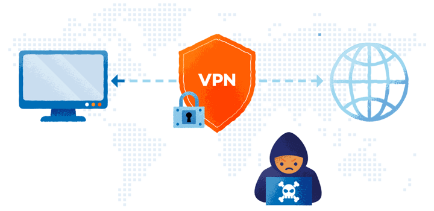

# **¿Que es un VPN?**

**VPN** significa **"Virtual Private Network"** (Red privada virtual) y describe la oportunidad de establecer una conexión protegida al utilizar redes públicas. 

Las VPN cifran su tráfico en internet y disfrazan su identidad en línea. Esto le dificulta a terceros el seguimiento de sus actividades en línea y el robo de datos. El cifrado se hace en tiempo real.

# **¿Cómo funciona una VPN?**

Una VPN oculta su verdadera dirección IP al permitirle a la red redireccionarla por un servidor remoto especial, alojado por el proveedor de una VPN. 

Esto significa que si navega en línea con una VPN, el servidor de la VPN se convierte en la fuente de sus datos. 

Esto significa que su Proveedor de servicios de internet (ISP) y otros terceros no pueden ver los sitios web que visita o qué datos envía y recibe en línea. 

Una VPN funciona como un filtro que convierte a todos sus datos en texto incomprensible. Si alguien lograra interceptar su información, de nada le sirve.

# **Mas información**
* [¿Qué es una conexión VPN, para qué sirve y qué ventajas tiene?][2_1]

* [¿Qué es una VPN y cómo funciona?][2_2]

[2_1]:https://www.xataka.com/basics/que-es-una-conexion-vpn-para-que-sirve-y-que-ventajas-tiene

[2_2]:https://latam.kaspersky.com/resource-center/definitions/what-is-a-vpn